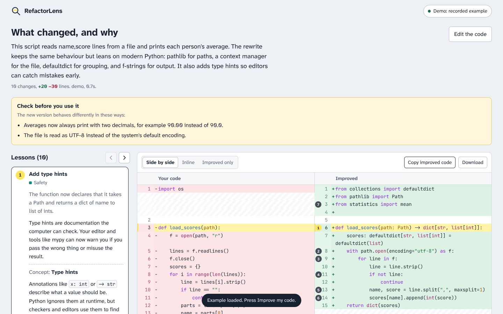

# RefactorLens

Paste code. Get a modern version of it, side by side with yours, and a short lesson on every change.

RefactorLens is a teaching tool, not just a rewriter. A language model improves your code, then explains *what* it changed, *why* the new version is better, and the general *concept* behind it, so you can use the idea next time without the tool.



## What it does

- **Before and after, side by side.** Switch to an inline diff, or see only the improved code.
- **A lesson per change.** Pick a lesson and its lines get highlighted in both versions. Step through them with the arrows or the `j` and `k` keys.
- **Libraries are a toggle.** Off: standard library only. On: it may suggest well-known packages, each listed with an install command.
- **Explanations at your level.** Beginner, intermediate or advanced.
- **Focus areas.** Readability, modern idioms, performance, safety, structure.
- **Honest about side effects.** Anything the new code does differently is listed under "Check before you use it".
- **Any language.** Python, JavaScript, Rust, Go, C++ and more.
- **Your choice of model.** Ollama (local, free, private), Anthropic Claude, or any OpenAI-compatible server (OpenAI, OpenRouter, LM Studio, llama.cpp, vLLM…).
- **One small binary.** The interface, fonts and syntax highlighter are built in. Nothing to install, and it works offline with Ollama.

## Quick start

You need [Rust](https://rustup.rs) 1.85 or newer.

```sh
git clone https://github.com/YOUR-NAME/refactorlens
cd refactorlens
cargo run --release
```

Open <http://127.0.0.1:7878>. Press **Try the example** and then **Improve my code** to see the whole flow without any model.

### Pick a model

Click the model button in the top-right corner.

**Ollama (local).** Install [Ollama](https://ollama.com), then pull a coding model:

```sh
ollama pull qwen2.5-coder:7b     # or :14b / :32b if your machine can handle it
```

Bigger models give better lessons. Small models (under 7B) often break the expected answer format.

**Anthropic.** Set your key before starting, or paste it in the settings:

```sh
ANTHROPIC_API_KEY=sk-ant-... cargo run --release
```

**OpenAI-compatible.** Set the server address and model:

```sh
OPENAI_BASE_URL=https://openrouter.ai/api/v1 OPENAI_API_KEY=... OPENAI_MODEL=... cargo run --release
```

For LM Studio use `http://127.0.0.1:1234/v1`; for llama.cpp's server, `http://127.0.0.1:8080/v1`.

### NixOS

```sh
nix run .          # build and run
nix develop        # shell with cargo, rustc, clippy and rust-analyzer
```

## Configuration

| Variable | Default | Purpose |
| --- | --- | --- |
| `REFACTORLENS_ADDR` | `127.0.0.1:7878` | Address to listen on. Also `--host` and `--port`. |
| `OLLAMA_URL` | `http://127.0.0.1:11434` | Ollama server |
| `OLLAMA_MODEL` | first installed model | Default Ollama model |
| `ANTHROPIC_API_KEY` | | Key for Claude |
| `ANTHROPIC_MODEL` | `claude-sonnet-5-5` | Default Claude model |
| `OPENAI_API_KEY` | | Key for an OpenAI-compatible server |
| `OPENAI_BASE_URL` | `https://api.openai.com/v1` | OpenAI-compatible server address |
| `OPENAI_MODEL` | | Model name for that server |

Settings changed in the browser override these and are saved in that browser. Keys typed into the browser stay in that tab only.

## Privacy and security

- Your code goes only to the model you pick. With Ollama it never leaves your computer.
- The server listens on `127.0.0.1` only. It refuses API calls that don't come from its own page, so other websites can't use your keys. Only expose it on a network you trust.
- API keys are never sent back to the browser.

## How it works

```
browser ──► POST /api/improve ──► prompt.rs builds a "teacher" prompt
                                   llm.rs sends it to the chosen model
                                   analysis.rs parses the JSON answer,
                                     finds each change's lines,
                                     and builds an aligned diff
        ◄── JSON with code, lessons and diff
```

| File | What lives there |
| --- | --- |
| `src/main.rs` | HTTP server, routes, request flow |
| `src/prompt.rs` | The instructions given to the model. The most important file to tune. |
| `src/llm.rs` | One function per provider |
| `src/analysis.rs` | JSON extraction, snippet location, diffing, with unit tests |
| `src/demo.rs` | The built-in example and its recorded answer |
| `ui/` | Plain HTML, CSS and JavaScript. No build step. |

A few design choices worth knowing:

- **The model quotes code; Rust finds the line numbers.** Models are bad at counting lines but good at copying text, so each lesson includes exact snippets and `analysis::locate` finds them.
- **One repair attempt.** If a reply isn't valid JSON, the model is shown the error and asked once more.
- **The library toggle is enforced twice:** in the prompt, and by dropping any dependencies from the answer when it's off.

## Contributing

Contributions are welcome. See [CONTRIBUTING.md](CONTRIBUTING.md).

## License

MIT. See [LICENSE](LICENSE). Bundled third-party assets keep their own licenses, listed in [`licenses/`](licenses/):
highlight.js (BSD-3-Clause), Atkinson Hyperlegible Next and JetBrains Mono (SIL Open Font License 1.1).
